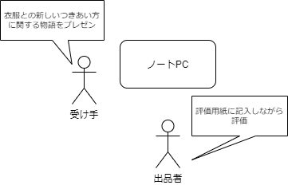

# ゲームマニュアル（受け手グループ用）

---
## スケジュール

---
## 受け手グループが主にやること
* 1月24日
  * 出品者の物語を読んで、出品者に納得してもらえる「衣服との新しいつきあい方」に関する物語をつくる
* 1月31日
  * 物語作成のつづき
  * 出品者の前で物語をプレゼンする(16:45～)
* 2月7日
  * 組のメンバーとして振り返りに参加

---
## 物語の作り方
* 物語の作成は、次の2つのシートを埋めることで進めます。
  * アイデアシート
  * 物語シート
* シートの収められたファイルには【記入用】と【書き方参考用】があることに注意してください。<u>記入するのは【記入用】とある方です</u>

---
## アイデアシート

* 衣服との新しいつきあい方に関するアイデアを整理するのに使うのがアイデアシートです
* 記載された質問に答えて空欄を埋めていってください

#### アイデアシートの例

* 今回送ったアイデアシートには例をつけています
* これらは、衣服との新しいつきあい方を実践している人の事例をもとに作成したものです
* 今回のゲームにはそのまま使えないかもしれませんが、「これくらい自由に考えてもいいんだ」という感覚をつかむための手がかりとして参照してください

---
## 物語シート

* アイデアシートの内容を物語の形式で表現するのが物語シートです
* 出品者に対してはこの物語シートをプレゼンします。 
* シートに記載された質問に答えて空欄を埋めていってください

---
## 物語のプレゼンと評価

* 1月31日の授業後半（**16:45～**）では、出品者が受け手グループA、Bの作成した物語を評価します
* 評価は、「**創造性**」「**共感性**」「**実行可能性**」の3つの基準から行われます

---
## 物語作成のポイント
* 評価の合計値が高ければ勝ちではありません。あくまで、出品者から衣服を渡してもらえたら勝ちです
* 評価基準の「創造性」「共感性」「実行可能性」はあくまで目安として考えて、出品者に納得してもらえる物語をつくることを目指してください

---
## 次回
* 1月24日はまずC301・302に集まってください