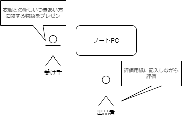

# ゲームマニュアル（出品者用）

---
## スケジュール

---
## 出品者が主にやること
* 1月24日までに物語をつくる
  * ゲーム開始時点で出品者の物語が必要です
  * 物語は配付資料として受け手グループに渡されます（出品者が読み上げる必要はありません）
* 1月31日の後半に、受け手グループがつくった「衣服との新しいつきあい方」に関する物語を評価し、衣服を渡す相手グループを決定する

#### その他、出品者がやること
* 1月24日、1月31日のゲームでは、31日後半の評価のとき以外、他の組の受け手グループにオブザーバーとして参加してください
* 2月7日の振り返りには、組の他のメンバーと一緒に参加して議論してください

---
## 物語の作り方
* 物語の作成は、次の2つのシートを埋めることで進めます。
  * 衣服プロファイルシート
  * 物語シート

---
## 衣服プロファイルシート
* シートに記載された質問に答えて空欄を埋めていってください
* これが、BAZAARでやり取りする衣服になります。
  * <u>自分が本当に持っている服（or持っていた服）を元にしてください。</u>
  * 多少創作が入っても構いません。
  * ただし、創作が入りすぎると受け手グループの物語を評価するときに評価がしにくくなるので、ほどほどにしてください。

---
## 物語シート
* シートに記載された質問に答えて空欄を埋めていってください
* 自分がその衣服をなぜ大切だと思っているのか、受け手グループに伝わるようにすることを意識してください
  * 注：受け手グループは、衣服プロファイルシートと物語シートを読んで、衣服との新しいつきあい方に関する物語をつくります

---
## 受け手グループの物語の評価・衣服の受け渡し
* 1月31日の授業後半（**16:45～**）では、受け手グループA、Bの作成した物語を評価し、衣服を渡す相手グループを決めます
* 評価は、「創造性」「共感性」「実行可能性」の3つの基準から行います
  * 評価用紙は1月31日に配布します

---
## 何のための評価？
*  必ずしも評価の合計値が高いグループの勝ちではありません。出品者から衣服を受け取ったグループが勝ちです
*  自分が納得できると感じる物語を提示したグループに衣服をあげてください。そのグループの評価の合計値が低くても構いません
* ただし、振り返りのときに、衣服を渡す相手グループを決めた理由についても説明できるようにしてください。「創造性」「共感性」「実行可能性」などの評価の値は、振り返りの際の説明の材料として役に立つはずです

---
## 具体的に何をすればいいの？
* **1月23日（日）までに**、衣服プロファイルシートと物語シートを完成させて下記アドレスまで送ってください
  * michiko.kimura.bouquet@vc.ibaraki.ac.jp
* 1月24日はまずC301・302に集まってください