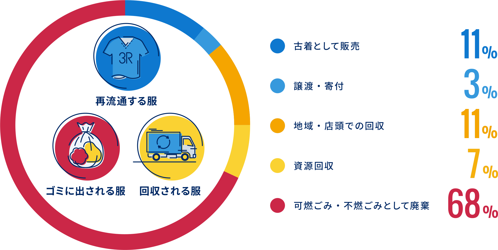
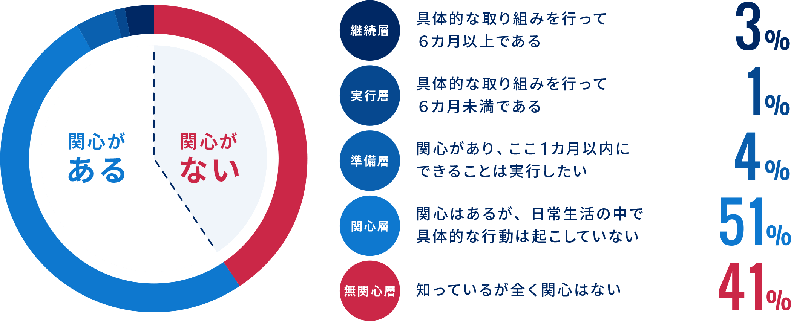
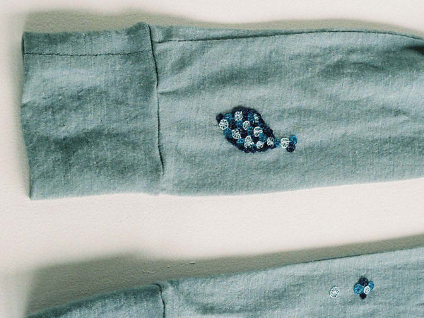

## 2021/1/17
# グループワークの説明

### 文責：小山田　晋（北海道大学大学院農学研究院）

---
## はじめに：サステナブルファッションが注目されている
* SDGsの隆盛の中、サステナブルファッションが注目されてるようになってきています
> ファッション産業は、製造にかかるエネルギー使用量やライフサイクルの短さなどから環境負荷が非常に大きい産業と指摘されており、国際的な課題となっています。そして、衣服の生産から着用、廃棄に至るまで環境負荷を考慮したサステナブル(持続可能)なファッションへの取り組みは、近年急速に拡がっています。

『環境省_サステナブルファッション』より
https://www.env.go.jp/policy/sustainable_fashion/

---

## 服を手放す手段

<!--https://www.env.go.jp/policy/sustainable_fashion/-->

環境省のサステナブルファッションに関する調査結果より
70％近くが大部分がゴミとして廃棄されている

<!--（2020年12月〜2021年3月に、日本で消費される衣服と環境負荷に関する調査を実施）-->

---

## サステナブルファッションへの関心割合

確かに「関心がある」の方が多数派だが、具体的な取り組みを行っている人はわずか4％にとどまる

---

## 多くの日本人にとって衣服廃棄の問題は身近でない

* ファストファッションの衣服は賃金の安い外国で生産される
* 衣服の大量廃棄が問題となっているのは途上国（先進国の衣服が捨てられている）
* 経済発展とともにお下がり・お直しといった文化も廃れてしまっている

<!--https://www.economist.com/science-and-technology/2017/08/24/sewing-clothes-still-needs-human-hands-but-for-how-much-longer-->

<!--BBCニュース「ファストファッションの末路……不必要になった衣服の埋め立て地」https://www.youtube.com/watch?v=kK9y_RtYWhM-->
<!--先進国の古着がアフリカなどの途上国に送られ、市場で売られる。でもファストファッションはすぐに劣化して着られないので、廃棄される。結果的に、途上国の廃棄場が古着でいっぱいになってしまう、ということ。この動画に出てくるのはガーナ。-->

---
## 自分（たち）にとって衣服はなぜ大切なのか？

* サステナブルファッションの問題を自分事として考えるのは難しい
* どうすれば自分事になるのだろうか？

### グループワークの目的

- 「なぜ衣服を大切にしなければならないのか？」「自分たちにとって衣服ってなんなんだろう？」　こうした問いへの答えを、自分の言葉で語れるようになることが目的です
- そのために、グループワークでは**衣服との新しいつきあい方を考えることに**取り組みます

---

## 「衣服との新しいつきあい方」とは？

たとえばファッションデザイナーの皆川明氏は、次のように述べています

> 人々は物を買い、使うことについて“消費”と言い、“消費者”と呼んできました。ですが、これからの日々の暮らしは、すぐに“消えてしまうもの”ではなく、物との関係を愛（いつく）しみ、記憶に残るような、まるで友のように長く繋（つな）がることが私たちの暮らしを豊かにし、環境を守ることに繋がります

讀賣新聞オンライン　2021/08/19「「１００年続くブランドに」　デザイナー皆川明さん」より。
<!--https://www.yomiuri.co.jp/life/20210812-OYT8T50075/-->

## 衣服との関係性を変えること
* 皆川氏は、衣服をただの「商品」ではなく、「友」として表現していることに注意してください
* ここでは衣服との新しい関係性（つきあい方）が提案されているといえます

---
## 衣服との新しいつきあい方の実践例1

### 横尾⾹央留の「お直し」

衣服の思い出や持ち主の性格を表現するように、あえて目立つお直しをする

> 彼⼥の仕事はお直し。やぶけてしまったブラウス、⾍に喰われたカーディガン、その時、その⼈がきたからこそできたキズに、意味をもたせるようにお直しをします。

横尾⾹央留（2012）『お直しとか』の書籍紹介⽂

<!--https://www.1101.com/yokookaoru/2012-02-20.html-->

---
## 衣服との新しいつきあい方の実践例2

### 稲垣えみ子の「究極の1着」
なるべく物を持たない生活を実践している稲垣氏は、「フランス女性はたくさん服を持たず、本当に似合う同じ服を来る日も来る日も着る」というエピソードをヒントに、服の数を極限まで減らすことを考える

> 究極の理想は……そうだな。夏は布一枚で過ごすっていうのはどうだろう。体にくるくる巻いて、ハイおしまい。洗濯も楽だし、サイズはいつだってぴったり。旅に出るのも風のように身軽。そんなことを考えていると、人生は実に自由で軽くて、本当に風になって空まで舞い上がっていきそうな気がするのであった。

東洋経済オンライン「お金を全く使わずオシャレを楽しむ｢意外な方法｣」より
<!--https://toyokeizai.net/articles/-/430979?page=4-->

---

## ゲーミングによるグループワーク

- グループワークでは、**ゲーミング** という方法で、衣服について考えていきます
  - 正式な名称は「ゲーミング・シミュレーション」
- ゲーミングとは、ゲームの世界において日常的には体験できないことを疑似体験することを通して、現実の社会現象を様々な視点から考察するための手法です

---

## ゲーミングの活用例

* 大学の授業でシムシティを利用し、都市開発や政治学について学ぶ
* バリアフリーへの理解を促すために障害者・高齢者にとっての歩行の困難さを疑似体験する

 

<!--シムシティを政治学の授業で利用しているMatthew C. Woessner氏のサイト。引用したのはチュートリアルの動画のスクリーンショット。https://sites.psu.edu/simcity/video-tutorial/-->

<!--ゴーグル装着し疑似障害者体験　厚木市職員が研修 社会 | 神奈川新聞 | 2015年6月14日(日) 03:00 https://www.kanaloco.jp/news/social/entry-60740.html-->

---
## 環境学習のためのゲーミング
- 環境学習にもゲーミングが使われています
  * 野生鳥獣問題の解決策を考えるためのゲーミング
  * 発電所の設置場所をめぐる合意形成のためのゲーミング　など
- 今回は、広い意味で、環境学習のためのゲーミングです。

---

## ゲーミングの内容
* 今回のゲーミングは2部構成になっています。

### 第1部　ゲームのプレイ（1月24日、31日）
* 不要な衣服のやり取りをするゲームをプレイ
### 第2部　ゲームの振り返り（2月8日）
* ゲームでの体験を踏まえて、衣服との新しいつきあい方について議論する

---
## どんなゲームをするのか？
* ゲームの名前：BAZAAR（バザー）
* 不要な衣服を誰か知らない人にあげるとしたら？　というシチュエーションを想像して行うゲーム
* 不要な衣服の**出品者役**と**受け手役**に分かれて行う

<!--
https://sewrendipity.com/2015/05/12/sustainable-tuesdays-first-hand-natter-about-second-hand-clothes-part-2/
-->

---
## BAZAARの世界観(ストーリー)
* BAZAARと呼ばれる、不要な衣服を受け渡しするシステムのある近未来が舞台
- 資源の枯渇が進み、物をリサイクルしたりリユースしたりすることは法律で国民に義務付けられている
  - 衣服の所持数には制限がある。違反すると罰金または懲役刑
  - 不要な衣服は積極的にほかの人に譲渡することが奨励されている
  - 衣服を新しく作ることもできるが非常に高価。多くの人は、ネット上の譲渡システムで見知らぬ人と衣服の受け渡し（売り買いを含む）をしている
  - しかし、見知らぬ人の衣服を着ること、見知らぬ人が自分の衣服を着るということに抵抗をおぼえる人も少なからずいる

---
## 出品者・受け手の役割設定
### 出品者（衣服をあげる側）の役割設定：
> あなたは捨てられない衣服を持っている。もう何年も着ていないし、受け取ってくれそうな知人もいない。ネットオークション等で売るのでは、買い手がその衣服をどう扱うのかがわからず、納得のいく扱い方をしてもらえるかどうか不安がある。あなたはBAZAARというシステムの存在を知り、そこに出品することを決意する。

### 受け手（衣服を受け取る側）の役割設定：
> あなたは衣服を無料で手に入れることのできるBAZAARというシステムの存在を知る。BAZAARでは衣服の価値は「値段」ではなく「物語」で表現されるという。物珍しさに惹かれたあなたはシステムにアクセスして、気に入った衣服を出品している人物に「この服がほしい」とメッセージを送る。

---
## BAZAARの手順：お金ではなく「物語」で衣服をやり取りする

---
## プレイヤーの目的
### 受け手グループの目的：
* 出品者に物語に納得してもらい、衣服を受け取ること
  * 1人の出品者に対して受け手グループは2つあります。だから、この2つのグループで争う、ということになります。

### 出品者の目的
* 受け手グループに衣服の価値が伝わるような物語を示し、自分が納得できる相手に衣服を渡すこと

<!--
* このゲームにおいて、出品者は勝ち負けを争う役割ではありません
* したがって、出品者には積極的に達成すべき目的はありません
  * 出品者は受け手グループに物語を示したあと、ほとんどすることが無くなります
  * 出品者は物語を提示した後、どこか別の組の受け手グループにも入ってもらいます
  * ただし、出品者役をした人の負担が大きくならないように、グループ内で作業分担を調整するよう注意してください
-->

---
## 物語で衣服をやり取りすることの意義
* 衣服の価値は、必ずしも論理的に説明できるものではありません。
  * その人の思い出も関わってくるし、文化的なものもある。なんとなく愛着がある、というのもある
* 論理で伝わらない衣服の価値についてコミュニケーションするために、物語を使います

---
## どんな衣服をやりとりするのか？

* 出品者役の人が実際に持っている（持っていた）なかなか捨てられない衣服
  * 本当に衣服を相手にあげるということではなくて、物語の題材として使うということです
  * あくまで物語の題材なので、多少は架空の設定が入っていても構いません
  * ただし、架空の設定が多すぎると、あとで受け手グループの物語を評価するときに困るので、必要最小限に抑えてください

---
## 補足：組は全部で3つつくります

* 出品者は物語をつくった後やることがほとんど無くなるので、別の組の受け手グループにオブザーバーとして参加します（1人2役）

---
## 補足：受け手がグループ単位である理由
* 受け手の方が作業はずっと大変です
  * 衣服との新しいつきあい方に関するアイデアづくり
  * 物語の作成
* グループ内で分担したり相談したりして、効率よく作業を進めてください

---
## ゲームの振り返りについて
* ゲーム中につくる物語は必ずしも多くの人に伝わるものとは限りません
* また、現実の社会制度や科学技術では実現できないアイデアが含まれているかもしれません
* 振り返りでは、出品者と受け手グループが協力してより広い視野から自分たちのアイデアを検討します

---
## 今後のスケジュール
* この後、アンケートを実施します。その回答をもとに、後日、役割を割り当てます
* 出品者には前もって、物語を作成する課題を割り当てます
  * 1月24日時点で出品者の物語が無いとゲームが開始できないからです
* ゲームマニュアルは事前にメールで送ります

---
## その他の補足
### 物語をつくるなんて難しそう……
* ゲームマニュアルに物語作成のためのフォーマットもつけて渡します
  * 基本的に、フォーマット通りに情報を入力していけば物語をつくれるようにしています

### ゲームでの役割はどう決める？　具体的に何をすればいい？
* 役割はアンケートの回答内容を踏まえて教員側で決めます
* 具体的に何をすればいいか（どこに集まるか、どうやってゲームを進めるか等）は、ゲームマニュアルに詳しく記載されています

<!--
### どうやってアイデアを出せばいい？
* アイデアを出すのがゲームの中で一番難しいところです
* アイデアを出すコツもゲームマニュアルに記載します
* ただし、マニュアルを頼りにしすぎず、日頃から衣服とのつきあい方を自分で考えたり、衣服との新しいつきあい方を実践している人の情報を意識的に集めたりしておくと良いと思います
-->

---
## その他の補足
### グループリーダー・進行役について
* ゲームでは、受け手グループには**リーダー**を1人割り当てます 
* 最終日の振り返りでは、議論の**進行役**を1人割り当てます
  * 受け手グループのリーダーを担当した人は対象から外します
* リーダーも進行役も、議論の流れを整理する、議論が進まないときに多数決を提案するなど、**あくまで交通整理の役割**であることに注意してください

---
## アンケート

* これからアンケートURLをメールで送ります
  * アンケートはグループワープでの役割を決めるためのものです
* 本日中に回答してください