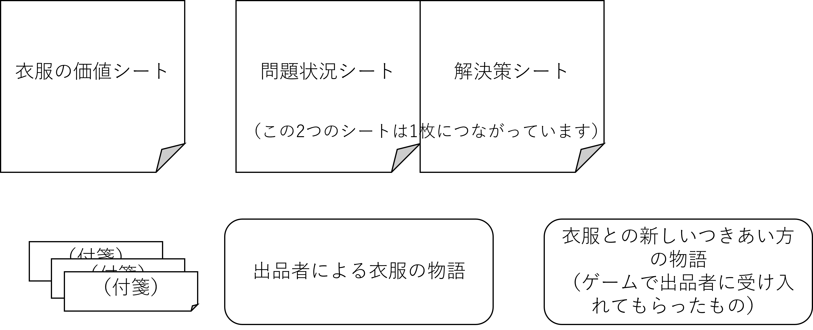
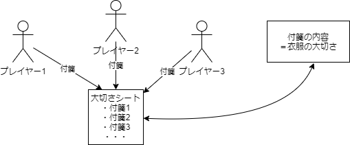
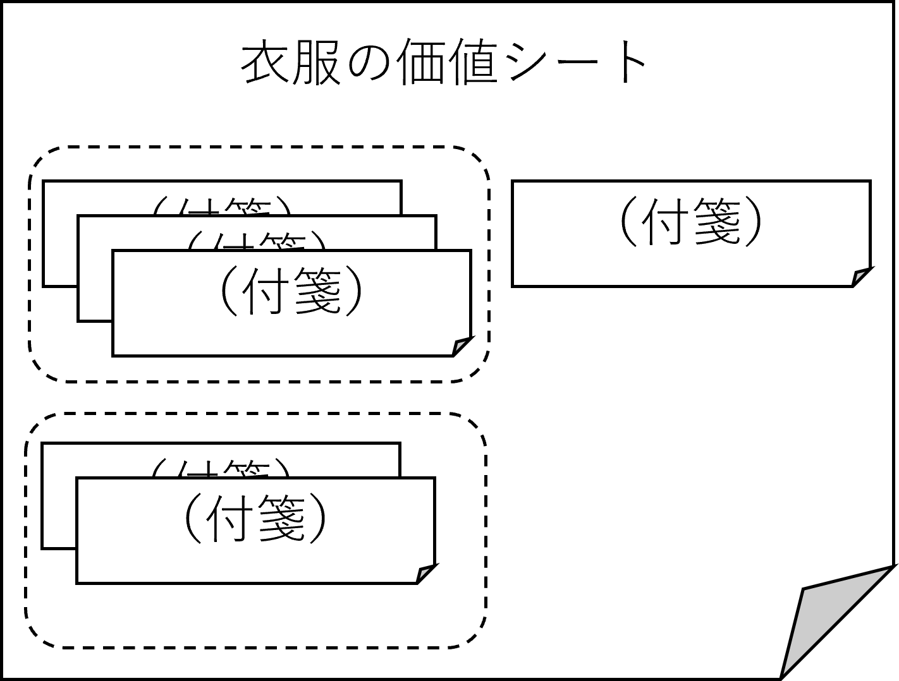
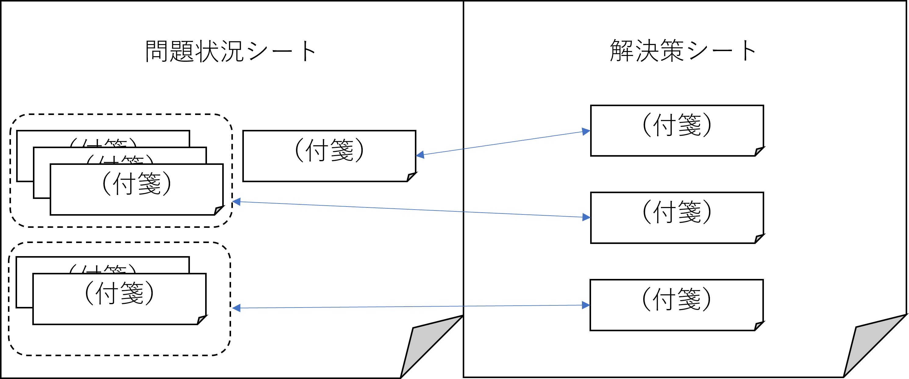
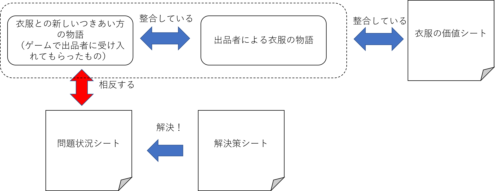

---

marp: true
paginate: true

---
# ゲームの振り返りの進め方

## 2022.2.8

<!--
負けたチームには問題点の指摘を中心的にやってもらう？ →　下記の作業を組み入れれば別に必要ないと思う。
出品者がなぜ受け入れたかというのをどこかで理由を言ってもらう？　
→　価値の共有のところで説明してもらおうかな。　その方が、選ばれなかった方が納得いく。組としての方向性を共有するフェーズ。
-->

---
## ゲームの振り返りのねらい

* ゲームの振り返りのねらいは、**ゲームでの体験を現実世界に生かしていくにはどうすれば良いか**について考えを深めていくことです
  * 具体的には、衣服との新しいつきあい方を現実世界で実践していく上での困難やその解決策について議論していきます

---
## 今日の流れ
1. 振り返りの進め方の説明（10分）　←　**今はここです**
2. 衣服の価値の共有（10分）
3. 「衣服との新しいつきあい方」の妥当性チェック（計50分）
   1. 問題のありそうな状況を考える（20分）
   2. 解決策を考える（30分）
4. 全体発表（15分）

---
## 振り返りは組単位で行います
* 出品者・受け手グループというゲーム内の役割を解除して、全員が組の対等なメンバーとして振り返りを行います
* 他の組にオブザーバー参加していた人（出品者）は、自分が出品者としての役割を割り当てられていた組のメンバーになります

---
## 振り返りに使う物品
* 3つのシートと付箋、そして、ゲームで用いられた物語が書かれた紙を使います
  * 付箋は内容を記入してシートに貼っていきます

  

---
## 2. 衣服の価値の共有（10分）
  
* ゲームで考えた「衣服との新しいつきあい方」によって、衣服のどんな価値が守られているかを付箋に書いてください
  * そのつきあい方を実践したらどんな良いことがあるか、という書き方でも構いません
  * ひとりで書いても、周りと相談しながら書いても構いません 
  * 枚数に制限はありませんが、一枚の付箋に書く内容は一つにしてください
* 書いたら、衣服の価値シートの適当なところに付箋を貼ってください

<!--

-->

---
## 2. 衣服の価値の共有（10分）

* 似ている内容の付箋があったらまとめて整理してください
* これが、「衣服の価値」に対する組の中での共通理解を示すものになります

---
## 3．妥当性チェック（50分）

* 提案された衣服との新しいつきあい方の妥当性を、様々な視点から検討していきます
* 具体的には、次の流れで妥当性をチェックします

  1. 問題のありそうな状況を考える（20分）
  2. 解決策を考える（30分）

---
## 3-i.問題のありそうな状況を考える（20分）
* 次の観点から、衣服との新しいつきあい方を実践するにあたり問題がありそうな状況を付箋に書き出して、問題状況シートに貼ってください
  * 現在の社会制度（法律や政治・経済の仕組み）の下で実行可能か？
  * 現在の身近な技術で実行可能か？
  * 自分たち自身にとって実行可能か

* 付箋に書く内容の例
  * 「自分には根気が無い」「自分にはスキルが無い」
  * 「○○という法律に違反しているかも」
  * 「個人で実践しようとするとお金がかかりすぎるかも」
---
## 3-i.問題のありそうな状況を考える（20分）
* 似ている内容の付箋があったらまとめて整理してください
* これが、「問題状況」に対する組の中での共通理解を示すものになります

---
## 3-ii. 解決策を考える（30分）

* 問題状況シートに示された「問題状況」に対する解決策を議論して考え、付箋に書き込んで解決策シートに貼ってください
* 「問題」と「解決策」の対応関係がわかるように、シートに矢印を書き込んでください
* できるだけ多くの「問題」を解決してください

---
## 3つのシートの関係性

* 3つのシートを完成させると、衣服との新しい生活を実践するための方向性が見えてきます

---
## 4. 全体発表（15分）
* 最後に、各組の成果を発表してもらいます
* 時間は1組あたり4～5分程度です。次の時間配分を目安にしてください
  * 衣服の物語（出品者によるもの）　1分半
  * 衣服との新しいつきあい方（出品者が納得したもの）　1分半
  * 衣服の価値、問題状況、解決策の説明　1分半